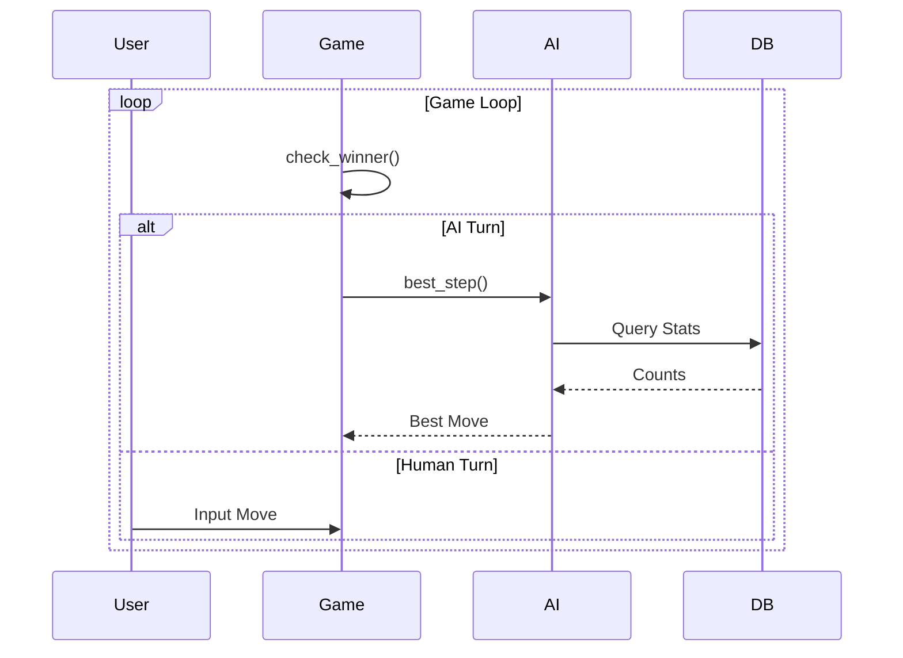
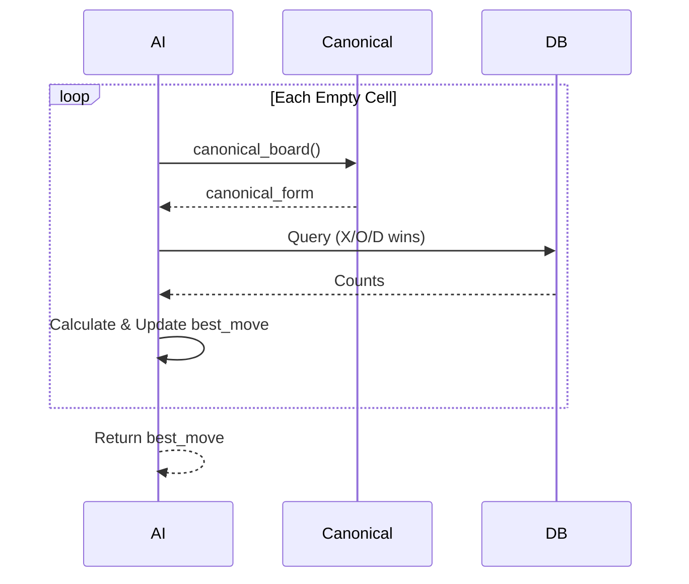
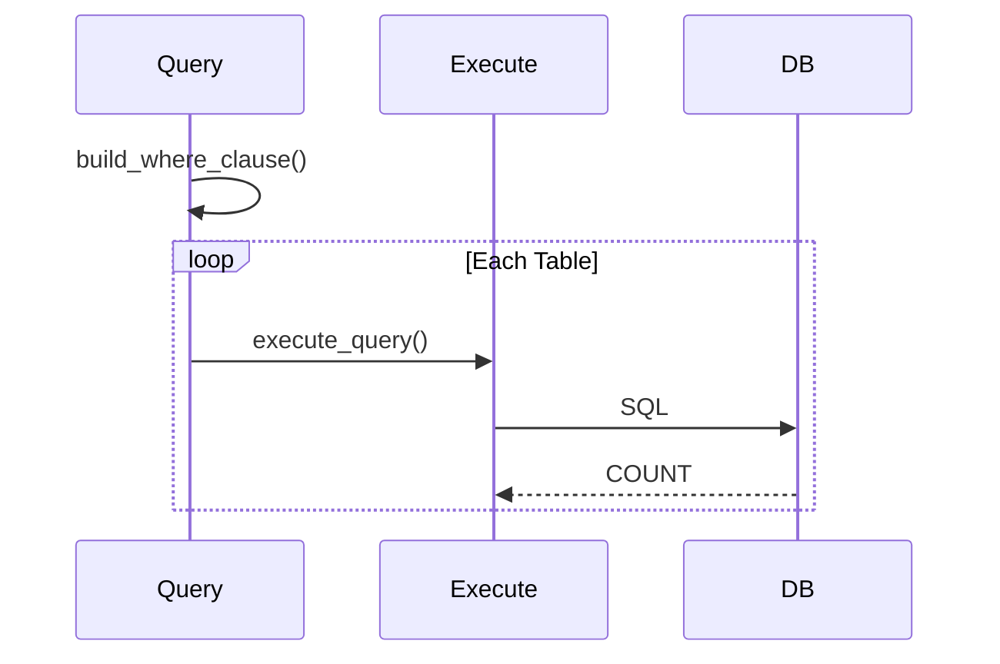
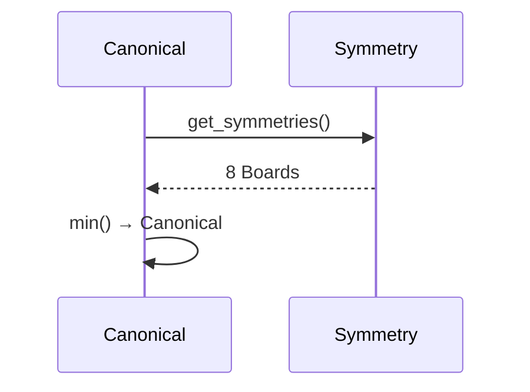

# Sequence Diagrams - Tic-Tac-Toe AI Algorithm

## 1. Main Game Flow

```mermaid
sequenceDiagram
    participant User
    participant Game
    participant AI
    participant DB

    loop Game Loop
        Game->>Game: check_winner()
        alt AI Turn
            Game->>AI: best_step()
            AI->>DB: Query Stats
            DB-->>AI: Counts
            AI-->>Game: Best Move
        else Human Turn
            User->>Game: Input Move
        end
    end
```

## 2. AI Decision (best_step)

```mermaid
sequenceDiagram
    participant AI
    participant Canonical
    participant DB

    loop Each Empty Cell
        AI->>Canonical: canonical_board()
        Canonical-->>AI: canonical_form
        AI->>DB: Query (X/O/D wins)
        DB-->>AI: Counts
        AI->>AI: Calculate & Update best_move
    end
    AI-->>AI: Return best_move
```

## 3. Database Query

```mermaid
sequenceDiagram
    participant Query
    participant Execute
    participant DB

    Query->>Query: build_where_clause()
    loop Each Table
        Query->>Execute: execute_query()
        Execute->>DB: SQL
        DB-->>Execute: COUNT
    end
```

## 4. Symmetry

```mermaid
sequenceDiagram
    participant Canonical
    participant Symmetry

    Canonical->>Symmetry: get_symmetries()
    Symmetry-->>Canonical: 8 Boards
    Canonical->>Canonical: min() → Canonical
```

